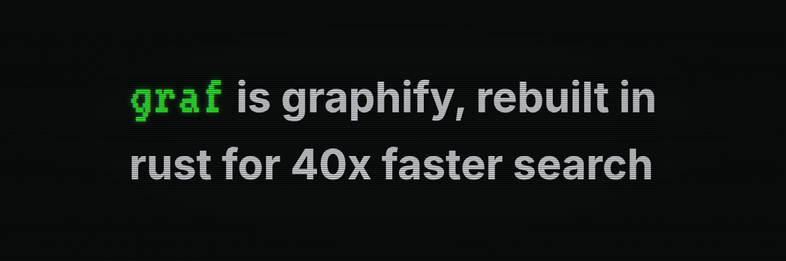
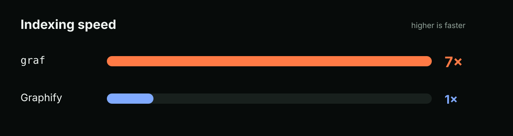
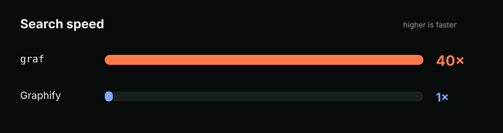

Grep can find a name. **graf** tells you who calls it, what depends on it, what might break if it changes, and how it connects to the rest of the repository.

Graf builds a persistent local graph from your source, docs, configuration, and database schemas. You and your agents can query it from the terminal without rebuilding the graph for every question. Static indexing is local and needs no API key, model, background service, or Python environment.

## Install

macOS and Linux:

```bash
curl -fsSL https://raw.githubusercontent.com/ctxrs/graf/main/install.sh | sh
```

Windows PowerShell:

```powershell
irm https://raw.githubusercontent.com/ctxrs/graf/main/install.ps1 | iex
```

The same command upgrades an existing install. See [installation and downloads](docs/downloads.md) for manual downloads, verification, supported platforms, and custom directories.

## Try it

From any project:

```bash
graf index .
graf stats
graf query authenticate
```

Replace `authenticate` with a symbol from your project, then copy its exact ID into an impact query. That shows the symbol, the code that depends on it, and the relationship between them:

```text
$ graf impact 'python:src/auth.py:authenticate@64'
Generation 1 (indexed snapshot)
python:src/auth.py:authenticate@64  function  authenticate  src/auth.py:4
python:src/auth.py:login@136         function  login         src/auth.py:7
python:src/auth.py:login@136 --calls--> python:src/auth.py:authenticate@64
```

Graf saves the graph at `.graf/index.db`. After changing code, update only what changed:

```bash
graf update
```

Use `--json` for structured output and an exact node ID when a name is ambiguous. The [usage guide](docs/usage.md) covers callers, callees, paths, filters, reports, exports, multiple projects, and supported inputs.

## Why Graf is better than Graphify

Graf is Graphify, but rebuilt properly in Rust: **7x faster indexing, 40x faster search, and one native binary.**





Graf was built from scratch around a persistent indexed graph. It updates the files that changed and answers navigation queries directly from SQLite. One native binary replaces the Python environment and dependency stack.

It is also stricter about correctness. Updates become visible as one complete generation, so a failed extraction cannot publish half a graph. When two symbols could be the answer, Graf returns the ambiguity and the source evidence instead of guessing.

Graf is an independent implementation, not a fork or a drop-in replacement for Graphify's Python API. The numbers above round the geometric mean of 19 successful indexing cases from four public repos and 19 successful searches from seven; both tools had to return the expected graph for a case to count. Graf trades more disk space for those indexes, and a few cold-indexing cases remain slower. See the [benchmark method, per-case results, and full caveats](docs/benchmarks.md).

## Migrate from Graphify

Run this from a project that already has `graphify-out/graph.json`:

```bash
curl -fsSL https://raw.githubusercontent.com/ctxrs/graf/main/install.sh | sh -s -- --from graphify
```

That installs Graf, imports the existing snapshot into `.graf/index.db`, switches a supported project MCP connection, and verifies the new server. It leaves Graphify, the original graph, skills, and hooks in place.

Already installed Graf?

```bash
graf switch graphify
```

The migration is reversible:

```bash
graf switch --undo
```

See [migrating from Graphify](docs/migrate-from-graphify.md) for Windows, custom graph paths, MCP configuration selection, compatibility details, and undo behavior.

## Use Graf with an agent

Install project guidance and a read-only MCP connection for Codex:

```bash
graf install --platform codex --project . --skill --mcp
```

Setup can be undone and does not overwrite unrelated configuration. See [agent setup and MCP](docs/usage.md#agent-setup-and-mcp) for Claude Code, Cursor, Gemini, VS Code, Aider, and other hosts.

## Build from source

Graf requires Rust 1.90 or newer and a C compiler:

```bash
cargo install --path . --locked
```

Graf is licensed under Apache-2.0. It is an independent project inspired by [Graphify](https://github.com/Graphify-Labs/graphify).
